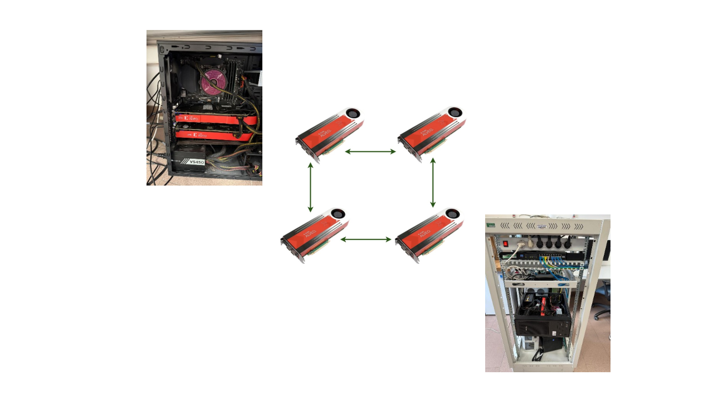

# PCIe gen5 x16 Cluster

The **PCIe Gen5 Cluster** is a state-of-the-art reconfigurable computing platform designed to explore high-performance, low-latency, and distributed computation paradigms. At its core, the system is built around a **PCIe Gen5** backplane equipped with eight PCIe x16 slots, enabling direct, high-bandwidth interconnection among multiple FPGA accelerator cards.
The cluster is being populated with AMD Alveo U50, U250, and U280 accelerator cards, each featuring high-speed **QSFP28 100 GbE** interfaces. This configuration enables a highly flexible experimental environment, supporting multiple interconnect topologies and computation models:

- **PCIe-based shared memory system**: the cards can communicate directly through PCIe, exploiting the on-board memory resources of each FPGA (e.g., 32 GB DRAM + 8 GB HBM on the U280, 64 GB DRAM on the U250) to implement shared-memory abstractions and memory-centric communication mechanisms.
- **Network-based communication**: the same setup can be reconfigured to use high-speed optical interconnects over 100 GbE, leveraging technologies such as RDMA over Converged Ethernet (RoCE) or custom networking protocols.
- **Hybrid configurations**: by combining PCIe and Ethernet interconnects, the system enables heterogeneous communication models that blend shared-memory and message-passing approaches.

This architectural flexibility makes the cluster an exceptional testbed for research in distributed and parallel systems, in-network computing, and heterogeneous acceleration. 
It supports experimentation with a broad range of applications, including:
- Distributed algorithms and consensus protocols
- Blockchain and fault-tolerant systems
- Distributed and federated learning
- Large Language Model (LLM) training and inference across accelerators
- Simulation and acceleration of real-world network environments

Overall, the PCIe Gen5 Cluster represents a unique research infrastructure enabling exploration at the intersection of reconfigurable computing, networking, and distributed intelligence, paving the way for next-generation computing architectures.

